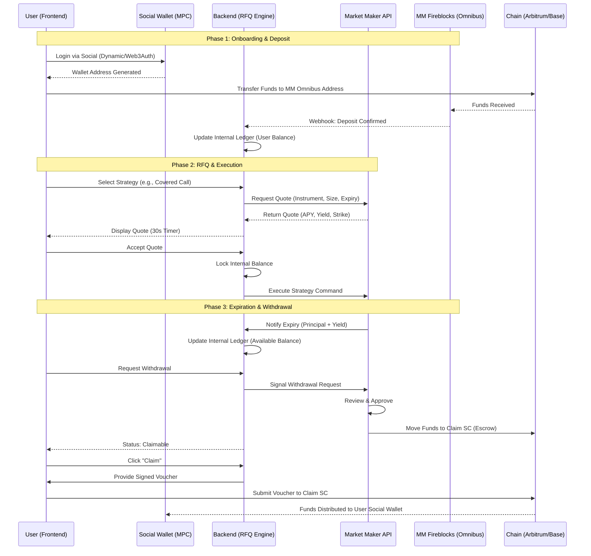

# Rysk-like DeFi App Research & Requirements

## Overview
A DeFi application similar to Rysk Finance, implementing 5 strategies with a centralized Market Maker (MM) integration.

## Core Requirements
- **Strategies:** 5 distinct financial strategies.
- **Market Maker (MM) Integration:**
    - Centralized architecture with a dedicated MM.
    - MM provides RFQ (Request for Quote) via an API.
    - Users fill a form -> App calls MM API -> MM returns yield, APY, etc.
- **Custody & Wallets:**
    - Funds deposited to MM's Fireblocks.
    - Single Fireblocks address for all user wallets (omnibus account model).
    - Social login for wallet creation (e.g., Web3Auth, Magic, or similar).
- **Lifecycle Management:**
    - **Expiration:** Upon position expiry, balance becomes available for new positions.
    - **Withdrawals:**
        1. User makes a withdrawal request to the MM.
        2. MM processes/approves.
        3. User claims funds.

## Research Topics
- [x] **Rysk Finance Architecture:** Analyzed Rysk V1/V1.2. Focus on physical settlement, 100% collateralization, and the RFQ engine for options (Calls/Puts).
- [x] **Fireblocks API/SDK:** Identified the **Omnibus Account Model** as the preferred approach for retail apps. It uses a single vault for pooled assets and internal ledgers for user tracking.
- [x] **Social Login Providers:** **Web3Auth** or **Privy** are ideal for mapping social identities to Fireblocks Vault IDs.
- [ ] **RFQ Systems:** Implementing the "Form -> Backend -> MM API -> Frontend" flow.
- [x] **Strategy Definitions:**
    1. **Covered Call (ETH/BTC):** Hold the asset, sell upside via call options. MM provides the bid for the call.
    2. **Cash-Secured Put (USDC):** Hold stables, earn yield by committing to buy at a lower price. MM provides the bid for the put.
    3. **Iron Condor:** A neutral strategy using both calls and puts. Best for sideways markets.
    4. **Yield Maximizer (Lending + Options):** Principal stays in Aave, yield is used to buy OTM options (lottery ticket style).
    5. **Managed Volatility (DHV):** User pools funds; the MM dynamically hedges to target a specific delta/gamma profile (reproducing Rysk's core product).

## Proposed Tech Stack

| Component | Recommendation | Why? |
| :--- | :--- | :--- |
| **Auth & Wallet** | **Dynamic** | Native Fireblocks integration, best-in-class social onboarding. |
| **Custody** | **Fireblocks Omnibus** | High security, gas efficient for retail, MM-friendly. |
| **Frontend** | **Next.js + Tailwind** | Rapid development, modern UI, seamless integration with Next API routes. |
| **Backend** | **Next.js (API Routes)** | **Unified Setup:** Shared types, single deployment pipeline, and minimal overhead for orchestration logic. |
| **Database** | **PostgreSQL** | Reliable source of truth for the internal ledger (use Prisma/Drizzle for Type-safety). |
| **Blockchain** | **Arbitrum / Base** | Low fees, high liquidity for underlying assets (WETH, USDC). |

## Implementation Roadmap

### Phase 1: Integration & Onboarding
- Set up Dynamic with Fireblocks NCW.
- Integrate MM API for basic deposit address generation.
- Build the internal ledger (DB) to track user balances.

### Phase 2: RFQ & Execution
- Implement the RFQ frontend form.
- Connect to MM API for live quotes.
- Build the "Accept & Lock" logic (Backend -> MM).

### Phase 3: Lifecycle & Expiration
- Automate expiration monitoring.
- Implement "Roll to New Position" feature using existing internal balance.

### Phase 4: Withdrawals
- Implement the "Request Withdrawal" flow.
- Build the "Claim" mechanism (Triggering MM's Fireblocks outbox).

## System Architecture

### 0. Workflow Diagram

#### Workflow Explanation:
1.  **Phase 1 (Onboarding & Deposit):** 
    - Users authenticate using social accounts via **Dynamic** (which orchestrates the Fireblocks Non-Custodial Wallet creation). 
    - To fund their account, users transfer assets from their social wallet to the **Market Maker's (MM) Omnibus Address**. 
    - The backend detects this deposit via Fireblocks webhooks and updates the internal database ledger to reflect the user's "Virtual Balance."

2.  **Phase 2 (RFQ & Execution):** 
    - When a user selects a strategy (e.g., Covered Call), the App requests a live quote from the **MM's API**. 
    - The MM returns specific parameters (APY, Strike Price, etc.). 
    - If the user accepts within the 30-second window, the backend locks the user's virtual balance and sends an execution command to the MM to open the position.

3.  **Phase 3 (Expiration & Withdrawal):** 
    - Upon position expiry, the MM notifies the backend, which unlocks the principal plus any yield in the user's virtual balance.
    - If a user requests a withdrawal, the MM performs a manual/automated review for risk compliance. 
    - Once approved, the MM moves funds into a **Claim Smart Contract (Escrow)**. 
    - The user then "claims" these funds by submitting a cryptographically signed voucher (provided by the App backend) to the Smart Contract, which then transfers the funds directly to the user's social wallet.

### 1. User Authentication & Wallet
- **Provider:** **Dynamic** (Recommended by Fireblocks) or **Web3Auth/Privy**.
- **Social Wallet:** When a user logs in via social, a non-custodial wallet (MPC) is created for them.
- **Role of the Social Wallet:**
    - It acts as the user's **Source of Funds** and **Destination for Claims**.
    - It is *distinct* from the MM's Fireblocks Omnibus.
    - User signs transactions from this wallet to deposit into the MM's system.

### 2. The RFQ Engine (Request for Quote)
- **User Action:** User selects a strategy (e.g., ETH Covered Call) and enters an amount.
- **Backend Action:**
    1. Validates user's **internal balance** (funds already in the MM's Omnibus).
    2. Calls **Market Maker (MM) API** with the request.
    3. Receives Quote (APY, Yield, Strike Price).
- **Frontend Action:** Displays the quote with a timer (e.g., 30 seconds).
- **Execution:** If user accepts, backend locks internal balance and sends execution command to MM.

### 3. Custody & Settlement (MM-Centric Omnibus)
- **Model:** Money is held in the **Market Maker's (MM) Fireblocks Omnibus Vault**.
- **User View:** The App shows a "Virtual Balance" representing the user's share of the pooled assets in the MM's vault.
- **Deposit Flow:**
    1. User's social wallet sends funds to the MM's Omnibus address.
    2. MM's system attributes the deposit to the user's ID.
    3. Internal ledger updates.

### 4. Strategy Lifecycle & Expiration
- **Position Opening:** User accepts an RFQ -> App calls MM API to "Lock" the funds into a strategy.
- **Expiration:** 
    - When a position expires, the MM calculates the final value (Principal + Yield - Fees).
    - The balance is updated in the MM's system.
    - The App reflects this "available balance" which can be rolled into a new position without moving funds on-chain.

### 5. Withdrawal & Claim Flow
1. **Withdrawal Request:** User initiates a request in the App.
2. **MM Review & Approval:** 
    - The request is sent to the MM API. 
    - MM reviews (checks for margin, settlement, and fraud).
    - MM approves the request.
3. **Escrow Funding:** 
    - Upon approval, the MM moves the requested funds from their **Omnibus Vault** to the **App's Escrow Wallet** (held in Fireblocks) or directly to a **Claim Smart Contract**.
    - *Safety Recommendation:* Using a **Claim Smart Contract** is safer for the end-user as it provides public transparency and programmatic assurance that funds are available for them.
4. **Claiming:** 
    - The App notifies the user that funds are "Claimable".
    - User clicks "Claim".
    - **Execution:** 
        - If using a **Claim Smart Contract**: The App backend provides a cryptographically signed voucher (via Fireblocks) which the user submits to the SC to pull their funds.
        - If using an **Escrow Wallet**: The App backend triggers a Fireblocks transaction from the Escrow wallet to the user's social wallet.
