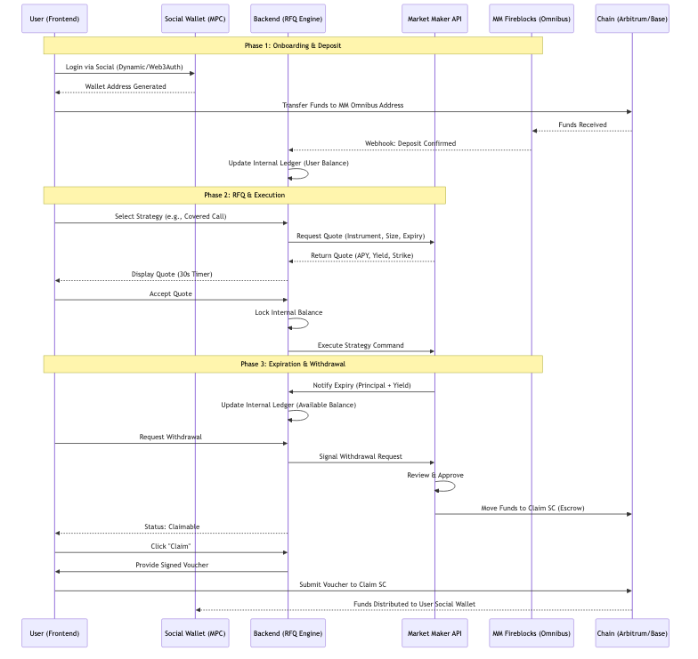

# Rysk Conversion Guide

This is the exact sequence used to convert `Rysk.md` into a Google Docs-ready `.docx` with the Mermaid diagram rendered as an image.

## 1. Inspect the Mermaid block

```bash
sed -n '60,110p' Rysk.md
```

## 2. Save the Mermaid diagram into its own file

Create:

```text
Rysk.workflow.mmd
```

## 3. Render the Mermaid file into a PNG

```bash
npx -y @mermaid-js/mermaid-cli -i Rysk.workflow.mmd -o Rysk.workflow.png -b white
```

## 4. Create a Google Docs-friendly Markdown copy

Create:

```text
Rysk.docs.md
```

Replace the Mermaid block with:

```md

```

## 5. Install the Python libraries needed to build a Word document
Use `Pandoc` to turn the Markdown into a Word document, then open that `.docx` in Google Docs.

Then run:

```bash
pandoc Rysk.docs.md -o Rysk.docx --resource-path=.
```

## 7. Verify the output

```bash
ls -lh Rysk.docx
file Rysk.docx
```

## Output Files

- `Rysk.workflow.mmd`
- `Rysk.workflow.png`
- `Rysk.docs.md`
- `Rysk.docx`

